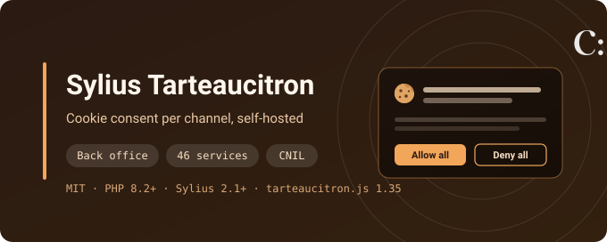
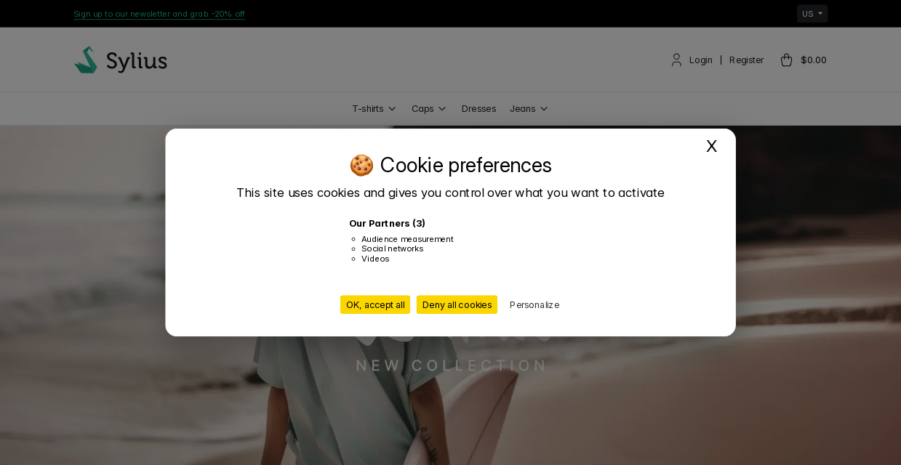
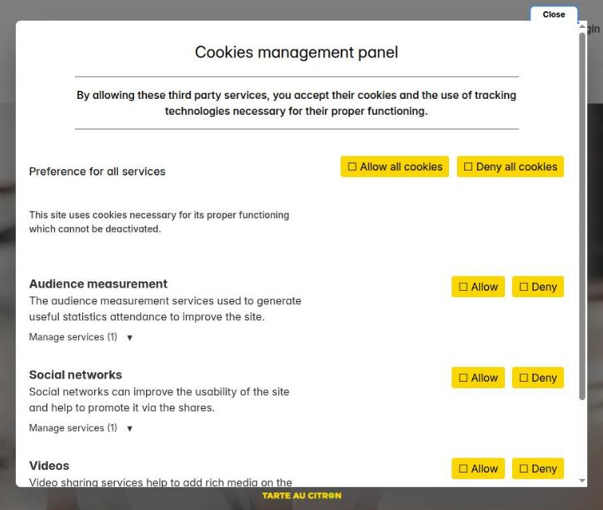
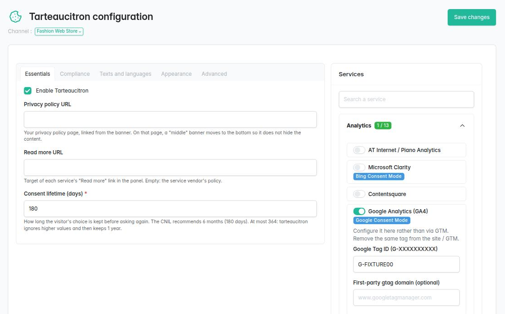

# Sylius Tarteaucitron Plugin

[](LICENSE)
[](https://packagist.org/packages/cyllene-digital/sylius-tarteaucitron-plugin)
[](https://github.com/CylleneDigital/SyliusTarteaucitronPlugin/actions/workflows/build.yaml)
[](https://github.com/CylleneDigital/SyliusTarteaucitronPlugin/actions/workflows/security.yaml)

Open-source [Sylius](https://sylius.com/) 2 plugin that performs the
[official tarteaucitron.js free, self-hosted install](https://tarteaucitron.io/en/free-installation-open-source/)
on a Sylius shop, with one configuration **per channel**:

- a back office to enable the banner, pick the services (46 built in) and tune the consent
  behaviour, with warnings when a setting departs from the CNIL cookie guidance;
- links and banner texts **per channel locale**, the banner language following the shop locale;
- the consent lifetime (6 months by default);
- vendor services and theme-level options from YAML, without code.

> tarteaucitron® is a trademark of tarteaucitron.io. This plugin is an independent integration,
> neither affiliated with, sponsored by, nor endorsed by the tarteaucitron.io publisher. It
> implements the **free open-source** library only. The commercial (Pro) offering is neither
> required nor used.

The library is **vendored** under `public/tarteaucitron/` and served from the shop
(`assets:install`). The plugin does not load tarteaucitron.js from a CDN and does not send
visitor data to `tarteaucitron.io` or `logs.tarteaucitron.io`.







## Compatibility

| Component | Versions |
|---|---|
| PHP | `^8.2` (Sylius 2.3: `^8.3`; Symfony 8: `^8.4`) |
| Sylius | `2.1`, `2.2`, `2.3` |
| Symfony | `^7.4`, or `^8.0` with Sylius 2.3 |
| tarteaucitron.js (vendored) | see `public/tarteaucitron/VERSION` (1.35.0) |

## What this plugin does not do

- It only gates services declared in its back office (tarteaucitron job keys). A script
  hardcoded in the theme, or a tag loaded by GTM outside this plugin, is **not** under
  consent.
- It does not keep a server-side proof-of-consent log. The choice lives in the
  tarteaucitron cookie.
- It ships a Sylius-oriented selection of the about 250 upstream services; any other one can be
  declared in YAML or with a PHP class.
- Its CNIL warnings are guidance, not legal advice: compliance stays the merchant's
  responsibility.

## Installation

```bash
composer config extra.symfony.allow-contrib true
composer require cyllene-digital/sylius-tarteaucitron-plugin
```

The [Flex recipe](https://github.com/symfony/recipes-contrib/tree/main/cyllene-digital/sylius-tarteaucitron-plugin)
registers the bundle, imports the routes and adds a commented
`config/packages/cyllene_digital_sylius_tarteaucitron.yaml`. Without Flex, or with contrib recipes
off, do it by hand. Register the bundle:

```php
// config/bundles.php
CylleneDigital\SyliusTarteaucitronPlugin\CylleneDigitalSyliusTarteaucitronPlugin::class => ['all' => true],
```

Import the routes (back-office page):

```yaml
# config/routes/cyllene_digital_sylius_tarteaucitron.yaml
cyllene_digital_sylius_tarteaucitron:
    resource: '@CylleneDigitalSyliusTarteaucitronPlugin/config/routes.yaml'
```

Publish the assets and create the two plugin tables:

```bash
bin/console assets:install
bin/console doctrine:migrations:migrate -n
```

Then, in the back office, **Configuration → Tarteaucitron**: enable tarteaucitron for the channel,
switch on the services the shop uses, fill their identifiers and save. tarteaucitron stays **off**
on a channel until then, and every service starts switched off. The screen is described in the
[back-office guide](https://github.com/CylleneDigital/SyliusTarteaucitronPlugin/blob/main/docs/admin/user-guide.md).

Last, give visitors a way to change their choice at any time, e.g. a footer link the library wires
itself (no inline JavaScript, so it works under a strict CSP):

```twig
<button type="button" id="manage-cookies" class="tarteaucitronOpenPanel">{{ 'app.footer.manage_cookies'|trans }}</button>
```

## Configuration

Nothing is required. The bundle configuration holds what belongs to the integration rather than
to a shop admin - CSP nonce (fixed, or per response with NelmioSecurityBundle), locale mapping,
theme-level options (external CSS, panel anchor, ad-blocker message…) and vendor services without
code:

```yaml
# config/packages/cyllene_digital_sylius_tarteaucitron.yaml
cyllene_digital_sylius_tarteaucitron:
    integration:
        custom_closer_id: manage-cookies   # focus back on the footer link when the panel closes
```

Full reference, and what belongs in the back office instead:
[bundle configuration](https://github.com/CylleneDigital/SyliusTarteaucitronPlugin/blob/main/docs/integration/configuration.md).

## Adding services

Any vendor service can be offered from configuration; the container build fails on an unknown job
key, a `user.*` key the service never reads, or a job key already built in:

```yaml
# config/packages/cyllene_digital_sylius_tarteaucitron.yaml
cyllene_digital_sylius_tarteaucitron:
    trackers:
        smartsupp:                      # tarteaucitron job key
            category: support           # analytic, ads, api, video, social, support, comment, other
            label: Smartsupp            # back-office name (translation key or text), default: the job key
            parameters:
                smartsuppKey:           # exact tarteaucitron.user.* key
                    placeholder: 'xxxxxxxx'
                    # required: true    # default; false for optional keys
                    # label: 'Smartsupp key'
            # embed: true               # for services replacing HTML placeholders (videos, widgets)
```

For more (admin hint, Consent Mode link), extend `AbstractTrackerDefinition` in your application;
autoconfiguration tags it:

```php
final class AcmeTracker extends AbstractTrackerDefinition
{
    public function getType(): string { return 'acme'; }
    public function getCategory(): TrackerCategory { return TrackerCategory::Other; }
    public function getParameters(): array
    {
        return [new TrackerParameter('acme_id', 'acmeId')];
    }
}
```

See [custom tracker](https://github.com/CylleneDigital/SyliusTarteaucitronPlugin/blob/main/docs/integration/custom-tracker.md)
(translation keys, embeds). To contribute a built-in tracker, see
[adding a tracker](https://github.com/CylleneDigital/SyliusTarteaucitronPlugin/blob/main/docs/development/adding-a-tracker.md).

### Embeds (YouTube, Maps, widgets)

Switch the service on in the back office; the placeholders stay in your theme, with the
tarteaucitron classes (e.g. `youtube_player`) of the
[official install](https://tarteaucitron.io/en/free-installation-open-source/).
Twig helper: `tarteaucitron_is_embed('youtube')`.

## Troubleshooting: the banner does not show

1. **tarteaucitron is off for this channel**, or was never saved: open
   **Configuration → Tarteaucitron** for that channel, enable it and save.
2. **No switched-on service needs consent.** tarteaucitron.js only opens the banner when a service
   waits for a choice. A service switched on without its required identifier is not loaded (the
   back office warns "incomplete").
3. **Visitor already chose.** The banner only shows again after the consent lifetime, or after
   deleting the `tarteaucitron` cookie (or the name set in the Advanced tab).
4. **Assets missing or stale**: a 404 on `bundles/cyllenedigitalsyliustarteaucitronplugin/…` in
   the browser console. Run `bin/console assets:install` again.
5. **The theme does not render the `sylius_shop.base.head` hook**, where the plugin injects its
   snippet.
6. **A Content-Security-Policy blocks the scripts**: give the plugin's script tags your nonce with
   `script_nonce_provider` (e.g. `nelmio`), see the
   [bundle configuration](https://github.com/CylleneDigital/SyliusTarteaucitronPlugin/blob/main/docs/integration/configuration.md#script_nonce--script_nonce_provider).
7. **`integration.use_external_css` / `use_external_js` are on** without the theme providing the
   files they disable.

## Upgrading

Upgrade the Composer package, then:

```bash
bin/console assets:install
bin/console doctrine:migrations:migrate -n
```

and read [UPGRADE.md](UPGRADE.md).

`assets:install` matters on every upgrade: the vendored library and the plugin stylesheet are served
from the copy in `public/bundles/`, while their URLs carry a fingerprint of the package files, so
without it browsers fetch the new URL and get the old file. If your theme overrides
`templates/shop/tarteaucitron.html.twig` or an admin template, compare it with the new version.

The vendored tarteaucitron.js is upgraded by the maintainers with each release
([how](https://github.com/CylleneDigital/SyliusTarteaucitronPlugin/blob/main/docs/integration/assets.md#upgrading-tarteaucitronjs)).

## Public contract

The shop Twig hook and functions, the tracker extension API, the bundle configuration keys, the
admin hooks and route, and the database tables only change in a major version. Everything marked
`@internal` may change in a minor version. The full list and the support policy:
[public contract](https://github.com/CylleneDigital/SyliusTarteaucitronPlugin/blob/main/docs/architecture/public-contract.md).

## Documentation

- [Back-office guide](https://github.com/CylleneDigital/SyliusTarteaucitronPlugin/blob/main/docs/admin/user-guide.md) - for shop admins
- [Bundle configuration](https://github.com/CylleneDigital/SyliusTarteaucitronPlugin/blob/main/docs/integration/configuration.md) - for integrators
- [Technical documentation](https://github.com/CylleneDigital/SyliusTarteaucitronPlugin/blob/main/docs/README.md) - architecture, rendering, persistence, tests

## Status

**Exercised in a real browser**: 22 Behat scenarios, 12 of them in headless Chrome against the
banner and panel as tarteaucitron.js renders them (accept / deny / personalize, the floating icon
with no service enabled, a channel in two locales with per-locale texts, the ad-blocker detection
path) and the back-office services column. The shop and the back office were also walked by hand
on a test application with two channels, one of them in English and French.

The continuous integration matrix covers Sylius 2.1 to 2.3, PHP 8.2 to 8.5, Symfony 7.4 and 8, on
MySQL, MariaDB and PostgreSQL, every Behat scenario included.

Two limits come from elsewhere: Sylius 2.3 on **MariaDB with DBAL 4** skips its own migrations
([details](https://github.com/CylleneDigital/SyliusTarteaucitronPlugin/blob/main/docs/persistence/migrations.md)),
and a few tarteaucitron.js options are ignored in some setups - the back office says so next to
the option ([list](https://github.com/CylleneDigital/SyliusTarteaucitronPlugin/blob/main/docs/domain/init-options.md#library-limits-tarteaucitronjs-1350)).

The scope stops at the free tarteaucitron.js install: no server-side proof-of-consent log, no
consent for scripts loaded outside the plugin (see "What this plugin does not do").

## Contributing

[`CONTRIBUTING.md`](CONTRIBUTING.md) - environment, required checks, conventions.

A flaw is reported privately: [`SECURITY.md`](SECURITY.md). Do not open it as a public issue.

## Provenance and licence

The plugin is released under the **MIT** licence - see [LICENSE](LICENSE).

The vendored tarteaucitron.js (`public/tarteaucitron/`) is © 2014 AmauriC, also under
the MIT licence; its own `LICENSE` is kept next to it and is not replaced by the plugin's.

---

Package: [`cyllene-digital/sylius-tarteaucitron-plugin`](https://packagist.org/packages/cyllene-digital/sylius-tarteaucitron-plugin)

Maintained by [Cyllene](https://www.groupe-cyllene.com), on GitHub as
[@CylleneDigital](https://github.com/CylleneDigital)
