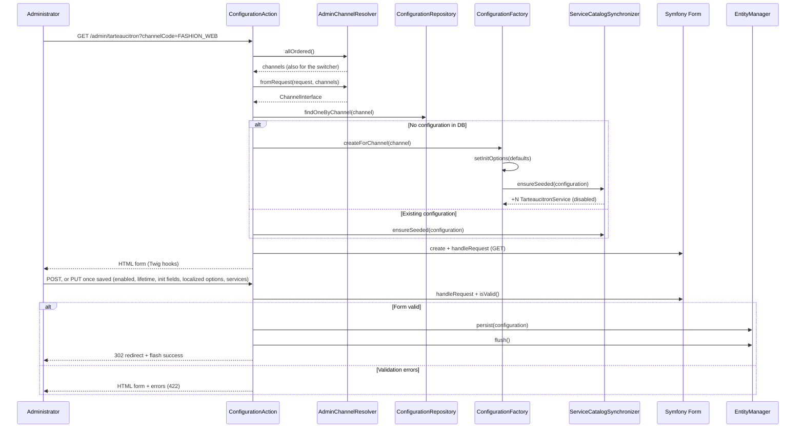

# Configuration flow (back office)

## Entry point

| Element | Value |
|---------|-------|
| Route | `cyllene_digital_sylius_tarteaucitron_admin_configuration` |
| Path | `/admin/tarteaucitron` (Sylius admin prefix) |
| Controller | `TarteaucitronConfigurationAction` (invokable) |
| Security | `#[IsGranted('ROLE_ADMINISTRATION_ACCESS')]` |
| Menu | Configuration → Tarteaucitron (`AdminMenuListener`) |

## Channel resolution

The shop channel context (`sylius.context.channel`) reflects the **visitor's** channel, not the one
the administrator edits. The page resolves it with `AdminChannelResolver` instead, which only the
back-office controller uses:

- `allOrdered()` lists the channels by id, once per request: the list feeds both the channel switcher
  and `fromRequest()`;
- `fromRequest()` takes the channel whose code equals the `channelCode` query parameter (exact,
  case-sensitive match: `?channelCode=FASHION_WEB`), a 404 when no channel has that code, and the
  first channel when the parameter is empty (a 404 when there is no channel at all).

The title template (`title.html.twig`) receives `channel` and `channels` for the switcher, which
links to `?channelCode=`. The redirect after saving keeps `channelCode`.

## GET sequence (form display)

```
Request (?channelCode=FASHION_WEB)
  → AdminChannelResolver::fromRequest()
  → Repository::findOneByChannel()
       ├─ null → Factory::createForChannel() + ensureSeeded()
       └─ exists → ServiceCatalogSynchronizer::ensureSeeded()
  → FormFactory::create(TarteaucitronConfigurationType)
  → handleRequest() (no-op on GET)
  → render admin/configuration.html.twig
       └─ hook 'update' (Sylius Admin UI)
```

## POST/PUT sequence (save)

```
Form submitted + valid
  → TarteaucitronConfigurationDataMapper writes enabled, consent_lifetime_days,
    init_options and localized_options on the entity, TarteaucitronServiceDataMapper
    each service's enabled flag and parameters
  → EntityManager::persist($configuration)
  → flush()
  → Flash success (cyllene_digital_sylius_tarteaucitron.ui.configuration_saved)
  → Redirect GET with same channelCode
```

If another administrator saved the same channel between this request's read and its `flush()` (the
first configuration of the channel, or a tracker row added since), the unique index refuses the
insert: the controller catches `UniqueConstraintViolationException`, flashes
`…ui.configuration_saved_concurrently` (error) and redirects to the page, which shows their version.

That only covers inserts. Two administrators editing an **existing** configuration at the same time
both save successfully, and the last save wins: the form posts every field, so it overwrites the
first one's changes without a warning. Detecting it would take optimistic locking (a version
column, so a migration).

Submitted but invalid: the page is rendered again with the errors (no redirect), with status 422. The tab holding
the first error is opened; see [Admin Twig Hooks](twig-hooks-admin.md).

## Factory

`TarteaucitronConfigurationFactory::createForChannel()` builds a new entity with the init defaults
and seeds its services.

An existing configuration goes straight through `ServiceCatalogSynchronizer::ensureSeeded()`, which
adds the trackers created since it was saved.

## Synchronizer

`ServiceCatalogSynchronizer::ensureSeeded()` - see [Trackers](../domain/trackers.md).

Does not persist: the controller flushes after form validation.

## Main template

`templates/admin/configuration.html.twig`:

```twig

```

Twig Hook prefixes:

- `cyllene_digital_sylius_tarteaucitron.admin.configuration`
- `sylius_admin.common`

so the page resolves `cyllene_digital_sylius_tarteaucitron.admin.configuration.update.*` first, then
falls back to `sylius_admin.common.update.*`.

Plugin content is injected by the `tarteaucitron` hookable of
`cyllene_digital_sylius_tarteaucitron.admin.configuration.update.content.form.sections.general`
(see [Admin Twig Hooks](twig-hooks-admin.md)).

## "Unconfigured" state on shop

Until a save has occurred:

- No DB row → shop sees tarteaucitron **off**
- First back-office open creates an in-memory entity with `enabled = false` and all services disabled
- After save without checking enabled → shop stays **off**
- Admin must enable tarteaucitron and the services they need, then save

## Sequence diagram


