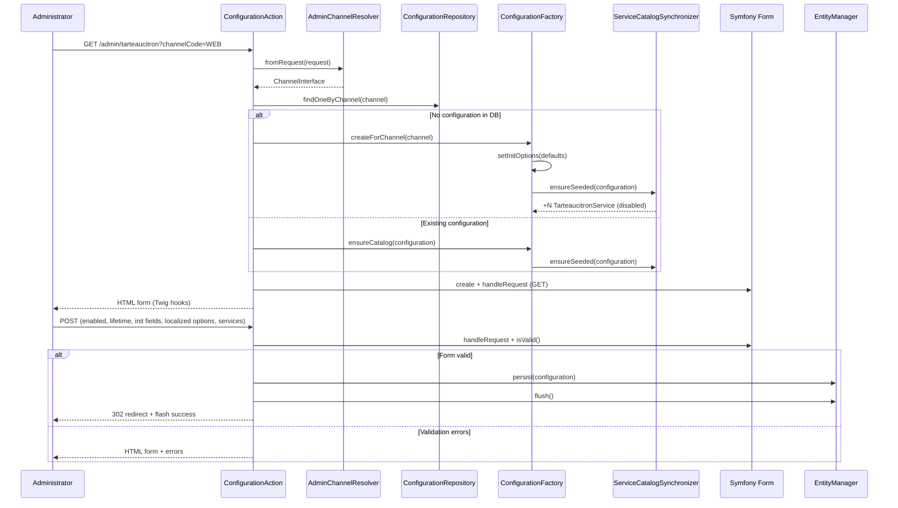

# Admin sequence — configuration save

## Actors

- Administrator
- `TarteaucitronConfigurationAction`
- `AdminChannelResolver`
- `TarteaucitronConfigurationFactory`
- `ServiceCatalogSynchronizer`
- `TarteaucitronConfigurationType` + DataMappers
- `EntityManager`

## Diagram

## Key points

1. **First GET** may create in-memory entity without `flush` — shop tarteaucitron stays off
2. **ensureSeeded** is idempotent — safe on every page open
3. **Init options** and **localized options** are unmapped fields, written to JSON by the DataMapper
4. **Validation errors** re-render the page; the first tab holding an error opens. CNIL warnings never block
5. **Redirect** keeps `channelCode` for multi-channel (and the `#tab-<id>` fragment, carried by the form action)

## Source files

- `src/Controller/Admin/TarteaucitronConfigurationAction.php`
- `src/Sylius/Factory/TarteaucitronConfigurationFactory.php`
- `src/Sylius/Synchronizer/ServiceCatalogSynchronizer.php`
