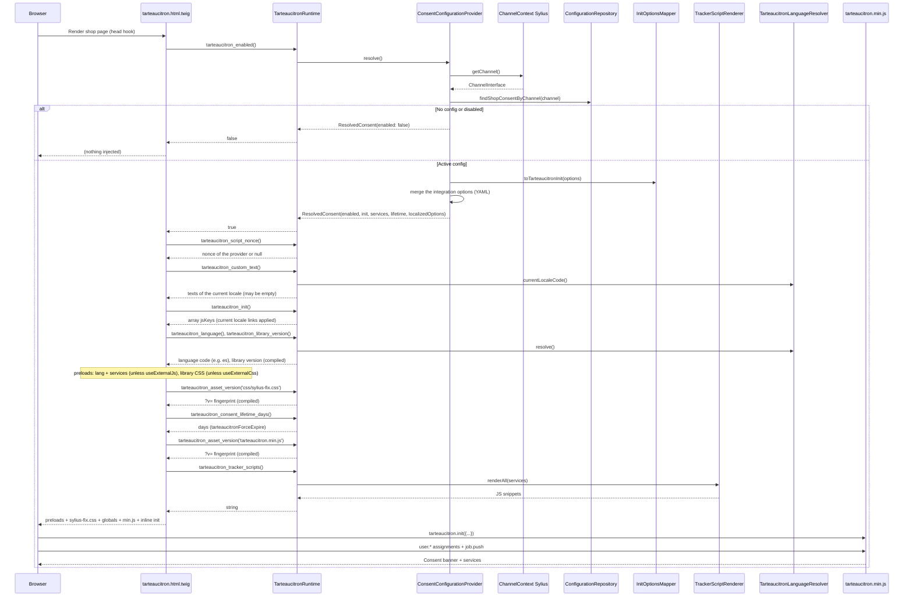

# Shop sequence - page render

## Actors

- Browser
- Twig (`sylius_shop.base.head`)
- `TarteaucitronRuntime`
- `ConsentConfigurationProvider`
- `InitOptionsMapper`
- `TrackerScriptRenderer`
- `TarteaucitronLanguageResolver`
- tarteaucitron.js (browser)

## Diagram

## Key points

1. **ChannelContext** determines which configuration to load - not admin query param
2. **Provider cache** - one expensive `resolve()` per channel/request
3. **`tarteaucitron_json`** filter in Twig for the init payload and the three globals
   (`tarteaucitronForceLanguage`, `tarteaucitronForceExpire`, `tarteaucitronCustomText`); **PHP
   `InlineJson`** in the script renderer for `user.*` - same flags
4. If enabled false → template emits no tarteaucitron script tags

## Source files

- `templates/shop/tarteaucitron.html.twig`
- `src/Twig/TarteaucitronRuntime.php`
- `src/Sylius/Provider/ConsentConfigurationProvider.php`
- `src/Consent/Tracker/TrackerScriptRenderer.php`
- `config/twig_hooks/shop.yaml`
